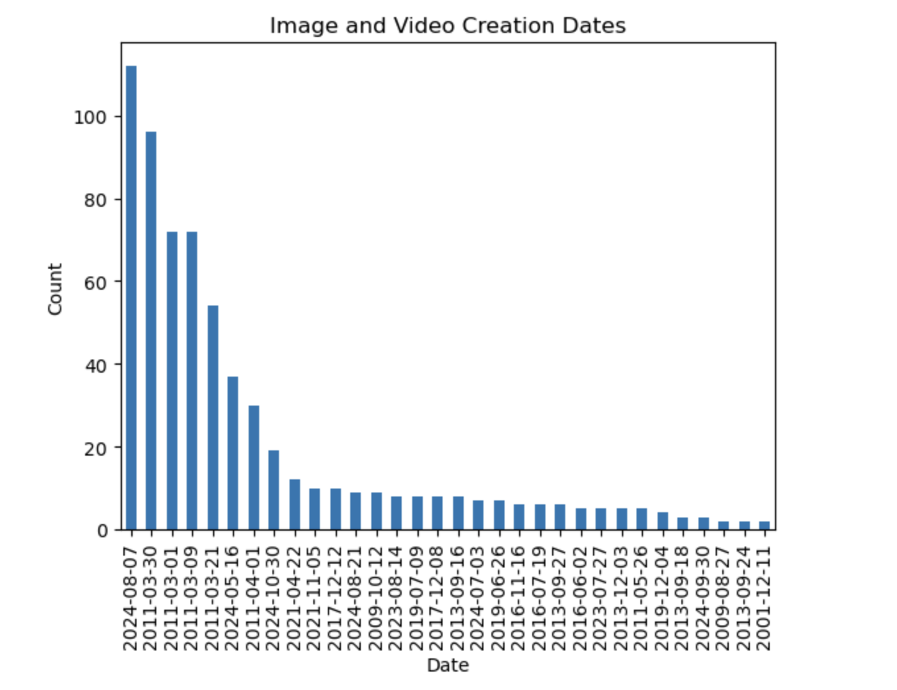
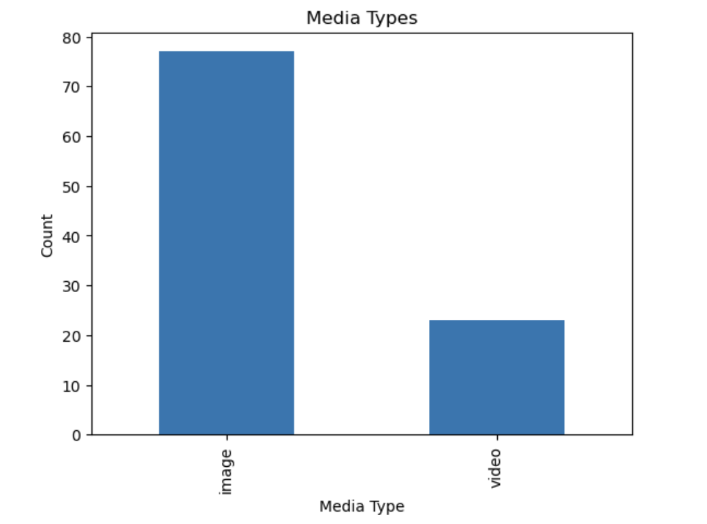
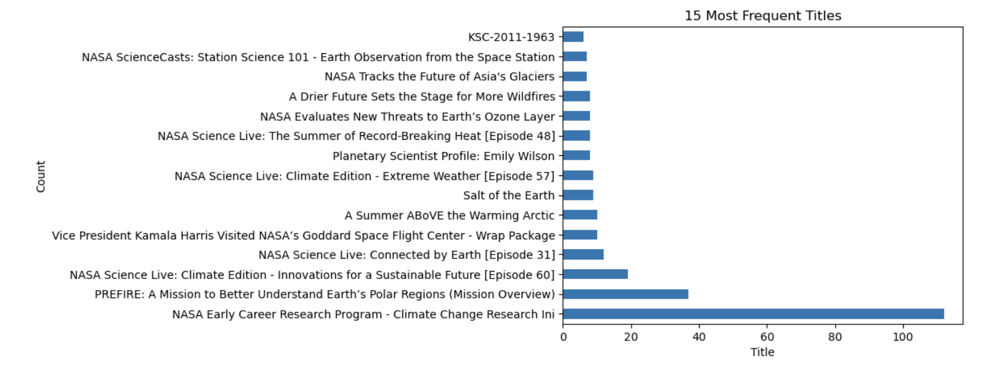
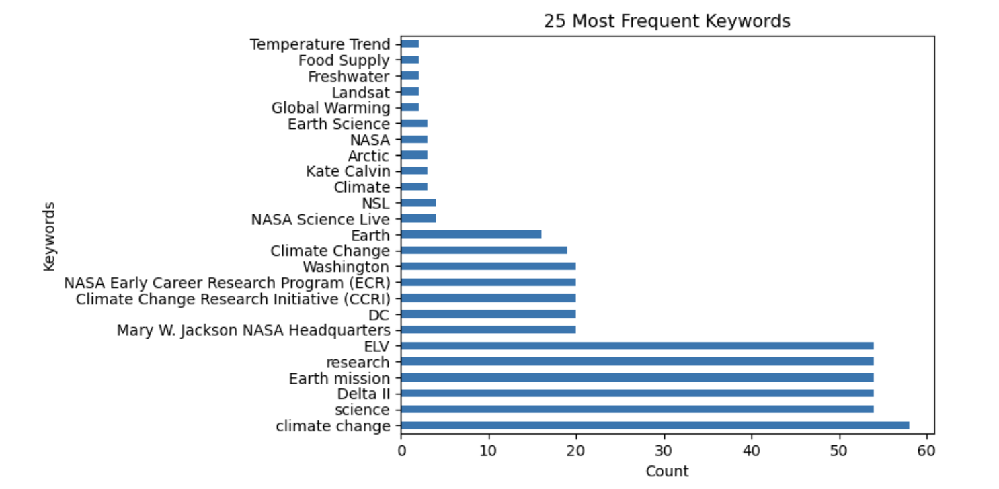
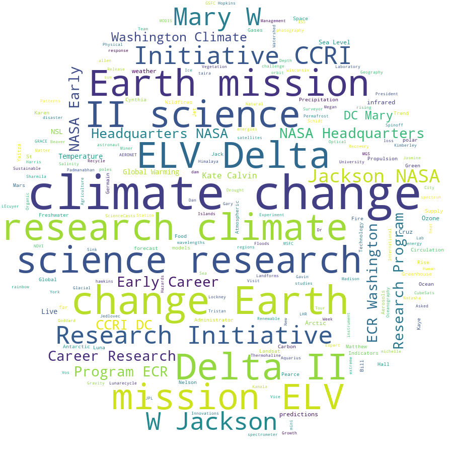
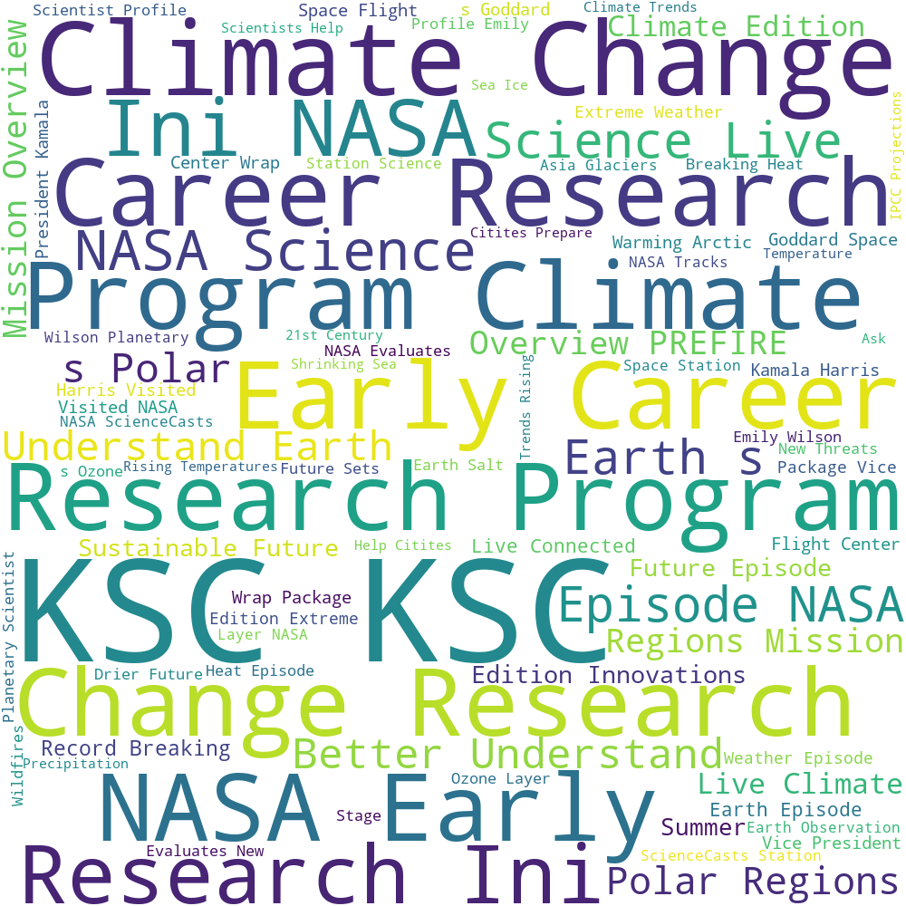
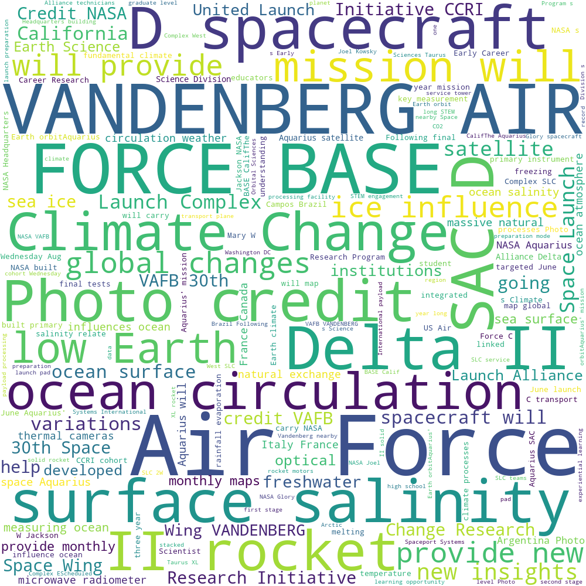
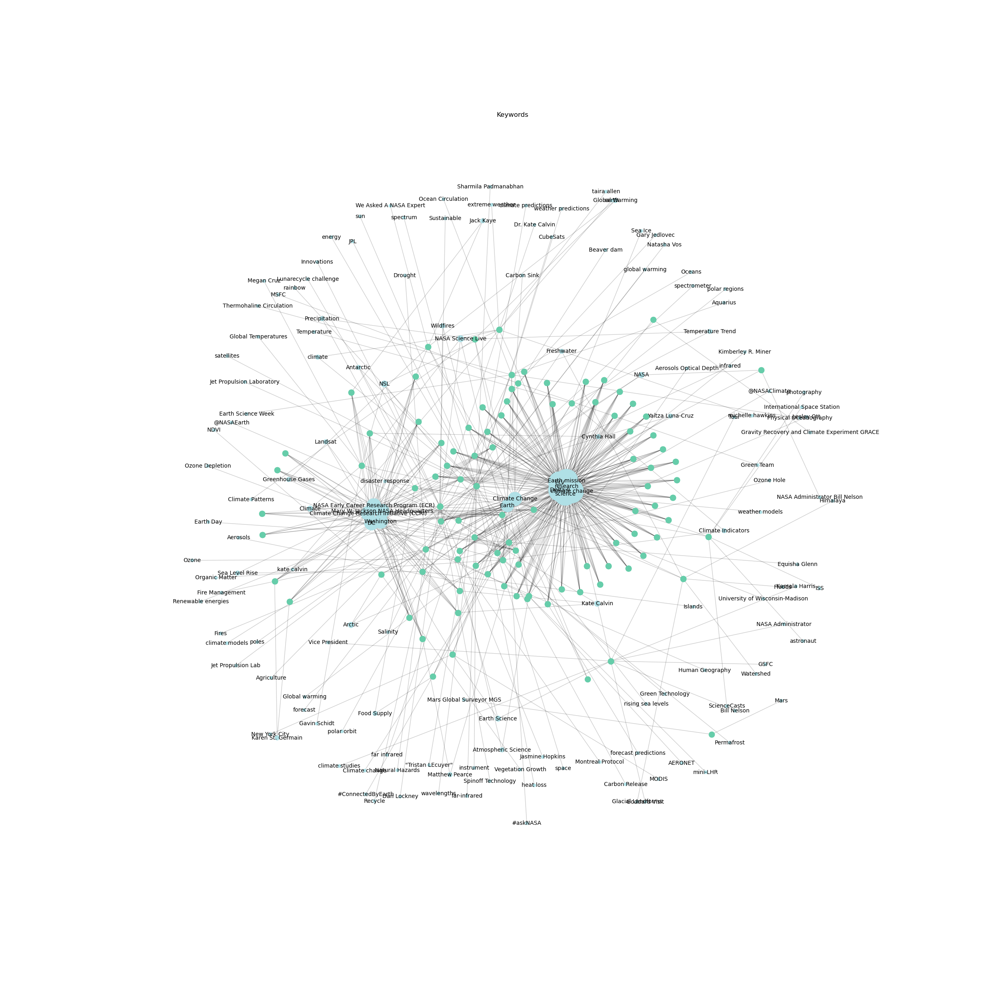
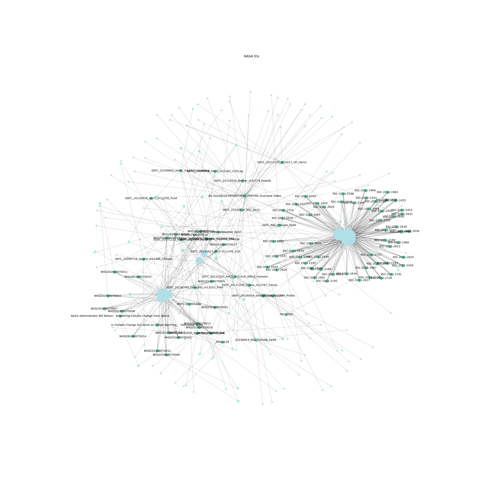
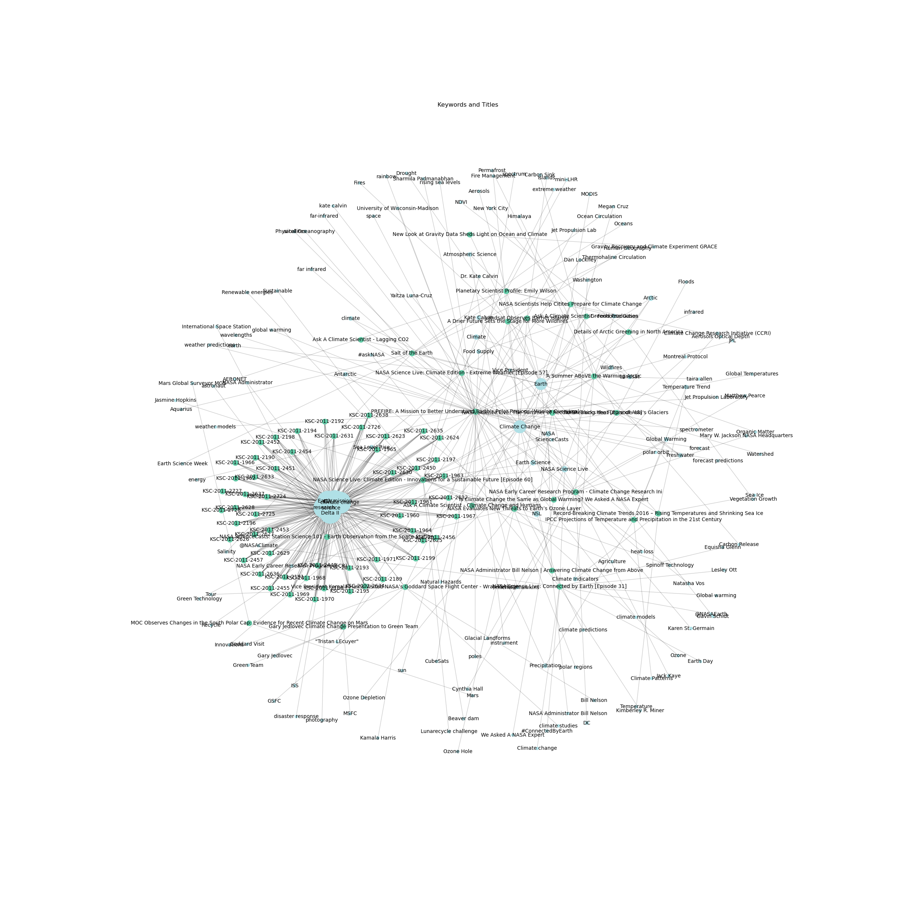

# Overview

### Goals
My aim with this project was to use the [NASA Image and Video Library](https://images.nasa.gov/) to create visualizations that demonstrate the way language is associated with images. I wanted this project to encourage viewers to think about metadata and how we describe images through keywords, titles, and decriptions. I also wanted to depict the words that appears frequently in the metadata of these images. Although these visualizations were created using a relatively small dataset, I hope that they demonstrate the range of words that are related to different pieces of information about an image or video.

### Process
1. I began with creating a data frame of the subjects I was interested in working with (keywords, titles, etc.).
2. I attempted to paginate through 18 pages of search results. I later realized this did not work.
3. I used **OpenRefine** to organize the data and remove unecessary punctuation and text. I returned to OpenRefine frequently throughout this process to help in creating different graphs.
4. I created a few graphs and visualizations with the data from one page of search results (100 results total). I began by trying to make various bar charts, but these did not work well with my data frame or in demonstrating how words were related to each other.
5. I learned how to make word clouds, which guided my the visualizations I chose to make moving forward.
6. I attempted to create a text network with **networkx**, it was successful but very messy, so I returned to working with the data in **OpenRefine**.
7. I created a new data frame that separated all of the keywords and enabled me to create neater text networks.
8. I used this to create text networks that displayed relationships between keywords, titles, and NASA IDs.

### Challenges
- Unable to paginate through the results.
- Because I could not get thorough data on the dates created for each image/video, it did not seem like I could create graphs that demonstrated anything accurate about the quantity of images/videos posted over time.
- Had issues achieving some of the things I had hoped to do (connecting keywords or IDs to links to the photos, creating a hover feature over the text network graphs so that the text would be more readable or include more information).

## Creating the Data Frame
```
import requests

key = {key}
query = 'climate change'
url = f'https://images-api.nasa.gov/search?q={query}'

r = requests.get(url)

r
parsed = r.json()
parsed.keys()
articles = parsed['collection']
items = articles['items']
items[0]['data']

titles = []
datesCreated = []
keywords = []
mediaTypes = []
descriptions = []
nasaIds = []
links = []

for i in items:
    title = (i['data'][0]['title'])
    titles.append(title)

for i in items:
    dateCreated = (i['data'][0]['date_created'])
    datesCreated.append(dateCreated)

for i in items:
    mediaType = (i['data'][0]['media_type'])
    mediaTypes.append(mediaType)

for i in items:
    description = (i['data'][0]['description'])
    descriptions.append(description)

for i in items:
    nasaId = (i['data'][0]['nasa_id'])
    nasaIds.append(nasaId)

for i in items:
    try:
        keyword = i['data'][0]['keywords']
        keywords.append(keyword)
    except:
        keyword = 'n/a'
        keywords.append(keyword)

for i in items:
    try:
        link = i['links']
        links.append(link)
    except:
        link = 'n/a'
        links.append(link)

print(len(titles), len(datesCreated), len(keywords), len(mediaTypes), len(descriptions), len(nasaIds), len(links))

import pandas as pd

df = pd.DataFrame({
    'title': titles,
    'date_created': datesCreated,
    'keywords': keywords,
    'media_type': mediaTypes,
    'description': descriptions,
    'nasa_id': nasaIds,
    'links': links
})
```
## Bar Graphs
I created a few simple bar graphs that depict the counts of some of the data.

 

 

## Word Clouds
I learned how to create word clouds. This step helped me better understand the data I was working with and provided me with more direction on what I could create with it.

### Word cloud based on keywords


### Word cloud based on titles


### Word cloud based on descriptions



## Text Networks
I ultimately decided to create text networks visualizations as a way to depict the connections between the keywords in this data frame. This step that took some trial and error, gave me lots of practice with libraries in python including **networkx** and **matplotlib**. I also experimented with some libraries that I didn't end up using, but am hoping to learn more about, such as **bokeh** and **seaborn**.

### Text network connecting keywords and NASA IDs (displaying keywords)



### Text network connecting keywords and NASA IDs (displaying IDs)



### Text network connecting keywords and titles



---

## Further Steps
- Improving the text network visualizations.
- Continue to work on adding links and hover features.
- Create more detailed bar graphs to display the data.
- Paginate through the query results to create more extensive data frames and graphs that include additional information like creation dates.
- Create visualizations from different queries and keywords.

## Thank you!